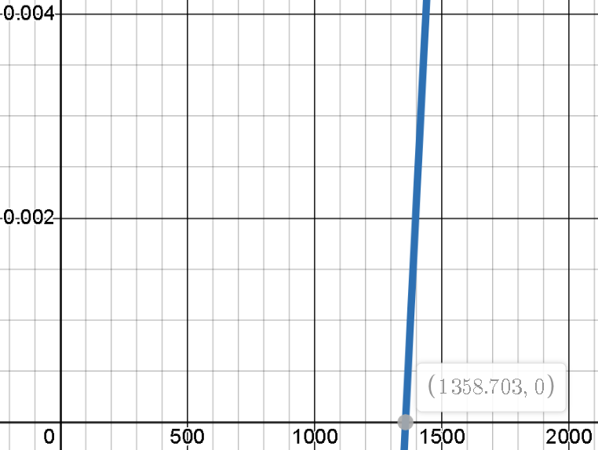

# Fees and Discounts

## What Rocketswap fees apply?

Rocketswap fees are set at 0.5% of the token cost for the trade.  This can be offset by a number of mechanisms to reduce fees through using and/or staking the Rocketswap token, RSWP. These actions are cumulative and can result in significant savings for market participants. Below are some typical scenarios that cover the fees and benefits of using RSWP:

### Scenario 1 - The baseline, 0.5% transaction cost

|Action|Description|Fee Paid in|
|:---:|:---:|:---:|
|Buy|TAU ➡ TOKEN| TOKEN|
|Sell|TOKEN ➡ TAU| TAU|

0.5% of the tokens traded are charged as the transaction fee. This fee, has 20% internally converted to RSWP and sent to the Lamden burn address.  The remaining 80% is added to the liquidity pool.  

### Scenario 2 - Fees paid in RSWP

|Action|Description|Fee Paid in|
|:---:|:---:|:---:|
|Buy|TAU ➡ TOKEN| RSWP|
|Sell|TOKEN ➡ TAU| RSWP|

Paying fees in RSWP automatically attracts a 25% discount.  This results in fees reducing to 0.375% of the tokens traded charged as the transaction fee.  Again, 20% of the RSWP is sent to the Lamden burn address. The remaining 80% is added to the liquidity pool.  

### Scenario 3 - Fees paid in RSWP and staking RSWP

|Action|Description|Fee Paid in|
|:---:|:---:|:---:|
|Buy|TAU ➡ TOKEN| RSWP|
|Sell|TOKEN ➡ TAU| RSWP|

As above, paying fees in RSWP automatically attracts a 25% discount.  However with additional staking, bonus **Trade Fee Discounts** apply based on the formula below.  There is a theoretical upper limit to discounts set at 99% within the contract however in practice this is not achievable.

Using the scenarios above, the resultant fees are visualised below compared to the baseline:

|Scenario|Description|Fee vs Baseline|
|:---:|:---:|:---|
|1|Baseline|</img> |
|2|Fees in RSWP|</img> |
|3|3700 RSWP Staked|</img> |
|3|34500 RSWP Staked|</img> |
|3|100k RSWP Staked|</img> |

A Lamden transaction fee to perform the necessary contract actions is also charged, generally around 65 Stamps (1 TAU) however is based on network traffic at the time the transaction is processed.

### Enough marketing talk.. give me the maths!

Discount formula is as follows:  
#### log<sub>e</sub>({RSWP Stake}) * 0.07 - 0.505
</img>

#### Why is the minimum stake 1361?
Zooming right in on the graph we can see it crosses the x axis not at 0, but pretty damn close to 1361 — at 1358.703 to be precise. At which point, based on the formula, if you put in less than 1358.703 you would actually be paying extra (not that this happens, as you can see in the contract below, the ‘discount’ can’t go negative).

</img>
### I need to see ze code!
Taking all the above into consideration lets look final piece of the puzzle - the contract and how it all adds up. Looking at the Rocketswap contract, con_rocketswap_official_v1_1, we can see the following:  
```python
__state['FEE_PERCENTAGE'] = decimal('0.5') / 100
```

This is the original fee percentage being 0.5%, the ‘__discount’ is defined below:  
```python
__discount = Hash(default_value=1, 
contract='con_rocketswap_official_v1_1', name='discount')
```

‘__discount’ defaults to 1 (no staking) however is calculated when you stake RSWP, therefore found under ‘staking’ in the contract:  
```python
__state['MULTIPLIER'] = decimal('0.07')  
__state['DISCOUNT_FLOOR'] = decimal('0.505')  
discount_amount = __state['LOG_ACCURACY'] * (__staked_amount[ctx.  
            caller, __state['TOKEN_CONTRACT']] ** (1 / __state[  
            'LOG_ACCURACY']) - 1) * __state['MULTIPLIER'] - __state[  
            'DISCOUNT_FLOOR']  
        if discount_amount > decimal('0.99'):  
            discount_amount = decimal('0.99')  
        if discount_amount < 0:  
            discount_amount = 0  
        __discount[ctx.caller] = 1 - discount_amount
```
        
You can see the formula mentioned earlier here. Also note.. technically 99% is the maximum discount however good luck getting that much RSWP. Lets go with the previous example of 34500 RSWP staked and a 22.641% discount for staking. In this case:  
```python
__discount[ctx.caller] = 1 - 0.22641
```

Looking at the ‘buy’ to put this into use:  
```python
fee_percent = __state['FEE_PERCENTAGE'] * __discount[ctx.caller]
```

which is:  
```python
fee_percent = 0.005 * 0.77359  
fee_percent = 0.00386795
```

then we add in our 25% discount for paying in RSWP:  
```python
__state['TOKEN_DISCOUNT'] = decimal('0.75')  
fee = tokens_purchased * fee_percent  
    if token_fees is True:  
        fee = fee * __state['TOKEN_DISCOUNT']
```
        
The above converts the fee into a token amount however we can still calculate the end result as a total discount.
```python
end result = 0.00386795 * 0.75  
           = 0.0029009625
```
           
Or 0.29% in fees instead of our original 0.5%.  
> [!Note]
> Let’s also not forget the 20% burn on Fees in RSWP putting positive pressure on RSWP price providing further indirect benefits for hodlers of RSWP.
